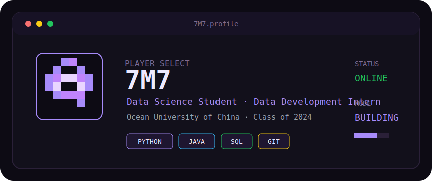

<div align="center">

<br/>



<br/>
<br/>

<a href="https://7M7666.github.io">
  
</a>
<a href="mailto:liwanlin0525@gmail.com">
  
</a>
<a href="https://github.com/7M7666">
  
</a>

</div>

---

```text
┌─ STACK ───────────────────────────────┐
│ Python    ████████░░                  │
│ Java      ██████░░░░                  │
│ SQL       ███████░░░                  │
│ Git       ██████░░░░                  │
└───────────────────────────────────────┘
```

```text
> clean data
> build tools
> write notes
> ship projects
```

<div align="center">

<sub>PRESS START TO BUILD</sub>

</div>
